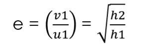

## Coefficient of Restitution Simulator

This project is for demonstration of Coefficient of Restitution. You can input height and Coefficient of Restitution and watch the simulation. Also project can print 10 height after bounce for your analysis.

**Coefficient of Restitution:** The ratio of final velocity to the initial velocity between two objects after their collision is known as the coefficient of restitution. The restitution coefficient is denoted as _‘*e*’_ and is a unitless quantity, and its values range between 0 and 1 (inclusive). <br/>
**Formula:** <br/>


_e = coefficient of restitution_ <br/>
_v = velocity after bounce_<br/>
_u = velocity before bounce_<br/>
_h2 = maximum heigth after bounce_ <br/>
_h1 = height from ball dropped_ <br/>

## Brief Project Structure

```
/
|-- CoefficientofRestitutionAnalysis/
    |-- bin/
        |-- application/                #Contains project class files
        |-- images/                     #Contains images used in the project
    |-- src/
        |-- application/
            |-- ball.java               #Contains methods applied on ball
            |-- main.java               #For initialization of screen and app
            |-- SampleController.java   #Controles motion of ball and set values
            |-- Sample.fxml             #Contains User Interface code (FXML)
        |-- images/                     #Contains images used in the project
```

## Setup Process

1.  Clone this repository in your local system.
2.  Download [Eclipse IDE](https://www.eclipse.org/downloads/) and setup Java Language in your machine.

3.  Download Java FXML, SceneBuilder and JPheonix <br/>
    [Java FXML Download Link](https://gluonhq.com/products/javafx/) <br/>
    [SceneBuilder DownLoad Link](https://gluonhq.com/products/scene-builder/) <br/>
    [JPheonix Download Link](https://github.com/sshahine/JFoenix)
4.  Open Eclipse and open _CoefficientofRestitutionAnalysis_ folder as project.
5.  Go to `Windows -> Preference`.
6.  Search _User Libraries_ and click _New_ and name JavaFX.
7.  Search _JavaFX_ and paste Scene Builder executable file path and JavaFX bin folder path in respective field.
8.  Go to `Run -> Run Configuration`.
9.  Move to _Java Application_ and select _Main_ and then _Argument_.
10. In VM arguments paste below code:
    ```
        --module-path "<Enter path to JavaFX/lib folder>" --add-modules javafx.controls,javafx.fxml
    ```
11. Click apply.
12. Right click on Project Name and in _Build Path_ select _Configure Build Path_ search for _Java Build Path_.
13. Click on Classpath, remove JavaFX and JPheonix already present in that, and from right select _Add Library.._ then click on _User Library_, select next and check _JavaFX_.
14. Drag _JavaFX SDK_ from Modulepath to Classpath.
15. Click on Classpath and from right select _Add External JARs.._ and select _JPheonix_ JAR file from your machine.
16. Click on Apply and close.
17. Project is now successfully setup in your machine :sunglasses:.
